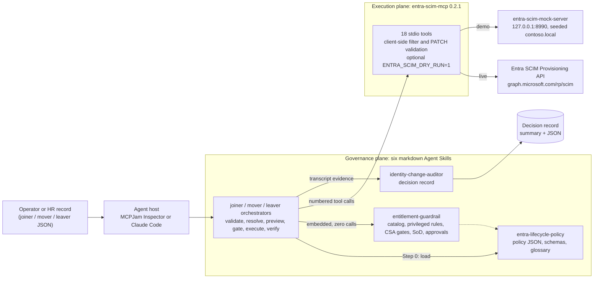
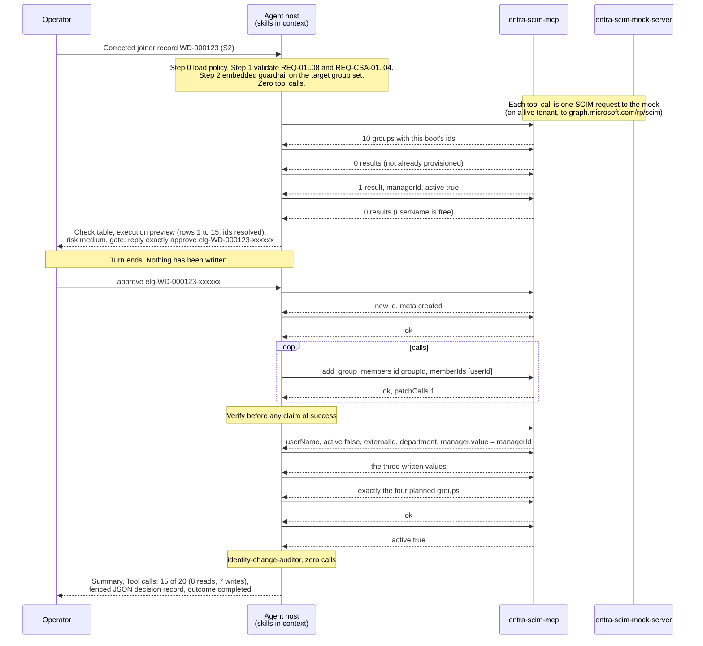

# Architecture

`entra-lifecycle-guardrails` splits lifecycle automation into two planes. The **governance plane** is six markdown Agent Skills that read one policy and decide. The **execution plane** is the published `entra-scim-mcp` server (0.2.1), which validates and sends SCIM requests. Neither knows the other's internals: the skills never build HTTP, and the server never reads the policy.

## The two planes

The operator (or an HR feed) hands a source record to the agent host. The host has the skills in context and the MCP server connected. An orchestrator loads the policy, runs the guardrail without any tool call, and only then starts numbering calls to `entra-scim-mcp`. The server turns each call into one SCIM request against the mock or the live API. At the end the auditor produces the decision record from what is in the transcript. The record leaves the system to the side; it is the artefact a reviewer reads, not something the tenant stores.

## Layering rules

| Layer | Owns | Never does |
|---|---|---|
| Policy skill (`entra-lifecycle-policy`) | The tenant rules as JSON: sources, required attributes and CSAs, group catalog, privileged groups, SoD rules, risk signals, approval thresholds, joiner/mover/leaver sequences, retained access, naming, cost budgets, audit requirements. Its JSON Schema and the decision-record schema. | Decide anything. Call a tool. Store an object id. |
| Guardrail (`entitlement-guardrail`) | Per-group evaluation in a fixed order: catalog, tenant resolution, privileged, allowed at joiner, profile risk ceiling, CSA gates, SoD on the resulting set, approval required, approval valid. Run decision by precedence, run risk by max. | Write. Override a `deny` with an approval. Pick a "closest match" group name. |
| Orchestrators (`joiner-`, `mover-`, `leaver-orchestrator`) | Record validation, id resolution, the preview, the gate, execution in policy order, verification reads, and handing evidence to the auditor. | Call discovery tools (`get_service_provider_config`, `list_resource_types`, `list_schemas`). Call `list_users` without a filter. Create, update or delete groups. Reuse an id from an earlier turn. Show a password. |
| Auditor (`identity-change-auditor`) | The decision record and the plain summary, built only from transcript evidence. Outcome classification. | Call a tool. Invent an id, timestamp, approval ref or count. Say `completed` without a proved verification finding. |
| MCP server (`entra-scim-mcp`) | The 18 tools, their input schemas, the Entra filter grammar (`eq`, `ew`, `and` only), PATCH validation, chunking of `add_group_members`, retries, and the dry-run flag. Tool annotations (`readOnlyHint`, `destructiveHint`). | Read the policy. Know what a joiner is. Batch across resources; every call is one billed request. |
| Host (MCPJam Inspector, Claude Code) | The model, skill discovery and injection, tool routing, credentials via environment (`.mcp.json` env blocks, `.env` through `scripts/mcp-live.mjs`). | Expose a secret to the skills. The skills never see `ENTRA_CLIENT_SECRET`; they see tool results. |

Three rules follow from the split:

1. **Names in, ids out.** Policy, seed and source records name things by `displayName` and `userName`. Ids exist only inside a run, are resolved by `list_groups` and filtered `list_users`, and are cited by call number in the record.
2. **Read only through the tool that is truthful on the live API.** The mock returns a CustomSecurityAttributes object in plain `get_user`; the live API never does. `customSecurityAttributes.trustOnlyDedicatedRead` makes every skill ignore it and read CSAs with `get_user_custom_security_attributes` only. Membership is readable only through `list_groups` filtered on `members.value`, one user at a time.
3. **The host cannot make a skill unsafe.** Dry-run is a server-wide environment flag, not a per-call option, and no tool takes a `correlationId`, `changeReason` or `approvalRef`. So the skills carry those in the transcript and the record, preview with zero calls, and treat any `dryRun: true` result as "nothing happened".

## The safe-by-default shape

Every orchestrator runs the same eight steps: validate, guardrail, resolve, preview, gate, execute, verify, audit. The shape is safe because of where the stops are, not because the model is trusted to be careful.

| Control | Where it lives | Effect |
|---|---|---|
| Zero calls before validation passes | Steps 1 and 2 of every orchestrator | A record with a missing mandatory CSA, an unknown source or a bad id pattern never reaches the tenant. S1 ends with `Tool calls: 0 of 20`. |
| Preview with zero calls | Step 4 | The numbered plan with resolved ids and a policy path per row is printed before any write. |
| Approval reference | `approvalThresholds.approvalRef` | Must be supplied by the operator or the record, match `^(CHG\|REQ\|INC)-[0-9]{5,}$`, carry `ref`, `scope`, `approver`, `sourceRecordId`, and match the record. A `deny` is never overridable. |
| Operator confirmation | `approvalThresholds.operatorConfirmRequired` | Medium and high risk end the turn. Only a later message containing `approve <correlationId>` continues; "yes" does not. |
| Create inactive, activate last | `joinerRules.createInactiveUntilVerified` | `provision_user` with `active: false`; `update_user active=true` only after three verification reads pass. A failure mid-sequence leaves an inactive account, which is the compensating control. |
| One removal per call, in policy order | `offboardingOrder.removalOrder`, hard rules | Privileged groups first. A 404 on `remove_group_member` means "not a member" and is confirmed at verification. Nothing is called on a user after `deprovision_user`. |
| Retained access is explicit | `retainedAccessRules` | `SG-Legal-Hold` (RET-001) is never removed by automation and is listed in the record with its rule id, not silently skipped. |
| Delete is gated twice | `offboardingOrder.deleteRequiresApprovalScope`, `deleteBlockedWhen` | Needs an approval scoped `leaver:delete` and is blocked outright while `csa.current.Compliance.LegalHold` is `true`. |
| Verify before "done" | `auditRequirements.verificationRequiredBeforeCompleted` | `completed` requires non-empty `verificationFindings.proved` with every item `pass`. |
| Budget | `costThresholds.maxToolCallsPerRun` | Every call counts, reads included. Warn at 80 percent, stop with `cost_budget_exceeded` at the budget. |
| Stop, do not improvise | STOP tables in every SKILL.md | 0 or more than 1 identity match, missing or invalid approval, `isError` mid-sequence, verification mismatch, unreadable policy: each maps to a decision, an outcome and a reason code. |

## The S2 joiner run

The corrected record for Priya Natarajan (`WD-000123`), run with `joiner-orchestrator` against the seeded mock.

Four reads to resolve, one create, one CSA write, four adds, three verification reads, activate and confirm: 15 of a budget of 20. The planned groups are `All Employees` and `SG-Finance-Users` from the Employee profile plus the two requested groups, `SG-Finance-AP-Requestors` (allow) and `SG-Finance-Treasury-Payments` (allow_with_approval, satisfied by `CHG-40012` with scope `group:SG-Finance-Treasury-Payments`). Risk is medium because Treasury-Payments is a medium-risk catalog entry, which is why the gate asks for confirmation. If S1 ran earlier in the same conversation, the record's `supersedes` names the S1 correlation id.

## CSAs as the policy signal

Custom Security Attributes are tenant-defined, typed, and readable only through a dedicated API, which makes them a better policy input than a free-text `department` or a group name. The policy declares two sets, `Employment` (`ContractType`, `CostCenter`) and `Compliance` (`DataClassification`, `LegalHold`), and uses them in four different ways across the scenarios.

| Scenario | CSA | Policy path | Effect |
|---|---|---|---|
| S1 | `Compliance.DataClassification` absent from the record | `requiredJoinerAttributes.customSecurityAttributes[REQ-CSA-03]`, `onMissing: deny` | Run denied with zero tool calls. The MCP server would have created the user; the policy says the record is incomplete. |
| S1, S2 | `Employment.ContractType = Employee` | `approvedBaselineProfiles.keyedBy` | Selects the Employee profile: base group `All Employees`, department group `SG-Finance-Users`, joiner risk ceiling medium. The same record with `Contractor` would get `SG-Contractors` and a ceiling of low. |
| S1, S2 | `Employment.CostCenter = FIN-100` | `groupCatalog[SG-Finance-Treasury-Payments].requiresCsa` (`startsWith "FIN-"`) | The treasury gate passes, so Treasury-Payments is allowed once its approval is present. |
| S3a | `Employment`, `Compliance` read for Adele | `customSecurityAttributes.trustOnlyDedicatedRead` | Read as part of the standard state capture; the deny comes from SOD-FIN-001, not from a CSA. |
| S3b | `Employment.CostCenter` FIN-110 to ENG-210 | `moverRules.reevaluateHeldGroupCsaGates`, the same `requiresCsa` on Treasury-Payments | A group nobody asked to remove is removed because the gate that justified it no longer holds. The check row is `warn` with `csa_condition_failed`, and the removal is in the preview before anything is written. |
| S4 | `Compliance.LegalHold = true` for Nestor | `offboardingOrder.deleteBlockedWhen` | Read with `attributeSets: ["Compliance"]` before planning. In `immediate` mode it is recorded; in `delete` mode it would deny the run with `delete_blocked_legal_hold` and zero writes. |

CSA string values compare exactly (`evaluation.exactMatchSubjectPrefixes: ["csa."]`), unlike group names, because Entra stores them case-sensitively. `csa.effective` is the requested value when the record supplies one, otherwise the current tenant value, and `csa.current` comes only from `get_user_custom_security_attributes`.

## The audit contract

Every run ends with one decision record, including blocked, awaiting-approval and rehearsal runs. The schema is `entra-lifecycle-policy/policy/decision-record.schema.json`; the full S1 record is `policy/decision-record.example.json`; field-by-field guidance is in `identity-change-auditor/references/record-template.md`.

**Header.** `recordVersion` (`1.0`), `correlationId` (`elg-<sourceRecordId>-<6 random lowercase alphanumerics>`, generated by the skill), `supersedes` (the earlier correlation id on a re-run, else `null`), `skill`, `skillVersion`, `policyId`, `policyVersion`, `event` (`joiner`, `mover`, `leaver`, `entitlement-evaluation`), `host` (`mcpjam`, `claude-code`, `other`), `dryRun`, `startedAt` and `completedAt` (copied from `meta.created` or `meta.lastModified` in tool results, else `null`), `clockSource` (`resourceMeta` or `none`), `source {system, recordId}`, `target {userName, id, displayName}`, `decision`, `outcome`, `riskLevel`.

**Required sections** (`auditRequirements.requiredSections`): `policyChecks[]` (one item per printed check row, same ids, `rule` as a dotted policy path, `evidence` citing `call #n`, `source record` or `policy`), `approvals[]` (every ref seen with `valid` and `used`), `plannedActions[]` (the preview rows with a redacted `argsSummary` and a status of `executed`, `skipped` or `not_attempted`), `executedActions[]` (every tool call in order with phase, status `ok`, `error` or `dryRun`, and the error object verbatim on failure), `skippedActions[]` (denied groups and unreached steps, each with a reason code), `verificationFindings {proved[], notVerifiable[]}`, `residualRisk[]` (what a human still owns), `toolCalls {count, budget, byTool}`. Then `nextSteps[]` and a `summary` of at most 200 words. Optional `details` carries the guardrail's `groupResults[]`, the mover's `before` and `after`, and the leaver's `mode`, `retained` and `residual`.

**Enums.** Decision: `allow`, `allow_with_approval`, `deny`, `require_manual_review`. Outcome: `completed`, `blocked`, `awaiting_approval`, `partial_failure`, `not_executed`, `rehearsal`. CheckResult: `pass`, `fail`, `warn`, `needs_approval`, `manual_review`, `skipped`. The 27 reason codes are listed in `entra-lifecycle-policy/references/policy-fields.md`.

**Invariants** the auditor checks before emitting: `toolCalls.count` equals the sum of `byTool` and the number of `executedActions`; every planned `seq` is accounted for as executed, skipped or not attempted; no key named `password` anywhere; `outcome: completed` only with non-empty, all-`pass` `verificationFindings.proved`; timestamps copied from results or `null` with `clockSource: none`; nothing in the record that is not in the transcript.

**Output order** in the chat: the plain summary, then `Tool calls: <count> of <budget> (<reads> reads, <writes> writes)`, then one fenced JSON block with the complete record. This is what appears in MCPJam's Chat view and what `npm run validate:policy` validates when a record is saved under `demo/expected/`.
